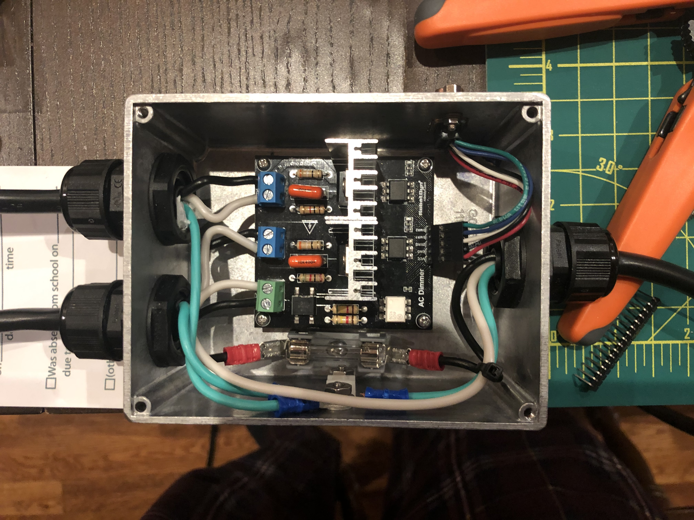

# Bluetooth LE Dual Fan Speed Controller

This project is a dual fan speed controller designed to change fan speed based on
the speed of a bluetooth speed sensor or smart trainer. It is based on two modules,
a mains triac controller and a nRF52840 SOC system.

The firmware is licensed with the
[MIT license](LICENSE) and was build using platform IO.
The nRF52840 module is an
[Adafruit Feather nRF52840 Express](https://www.adafruit.com/product/4062)
and a big kudos to Adafruit and all the work they do for open hardware.

